# Go2

## Cutting and Displaying of Intersecton of Vector Geomety, Like Line and Circle, Within Non-self-intersected polygon

矢量图形（line和circle）在非自交多边形边界中的裁剪显示

### `第四届“中国软件杯”大学生软件设计大赛`作品

for `The 4th CHINA SOFTWARE CUP University Students Software Design Competition`

* Design Document 设计文档

[](doc/Go2DesignGuide.pdf)

* Demo Video 演示视频

[](demo/Go2.swf)

* Dev Env Setup 开发环境搭建

[](env/QtDevGuide.pdf)

## Screen Shots 运行截图

* Functional Test 功能测试

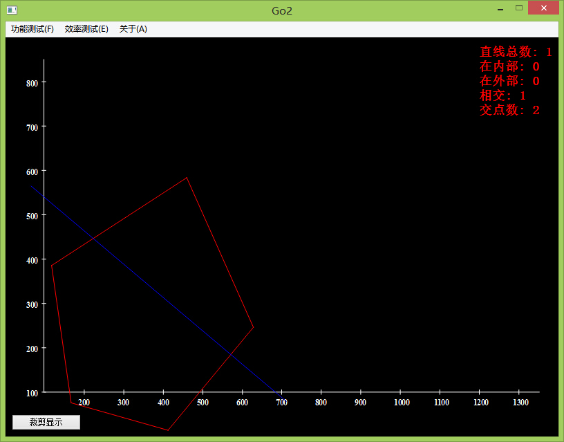

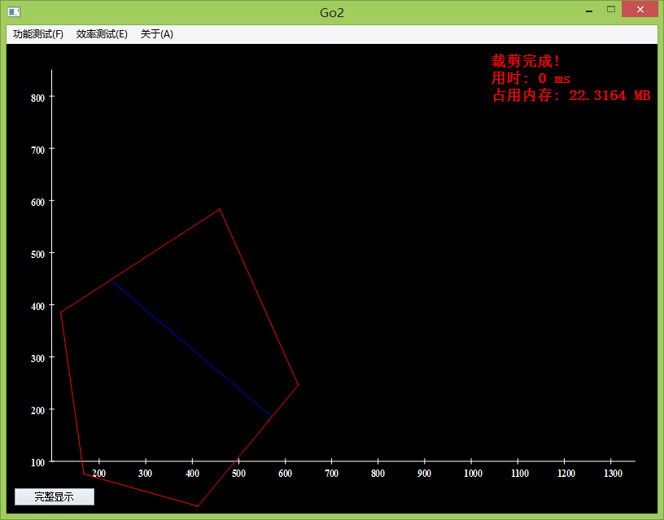

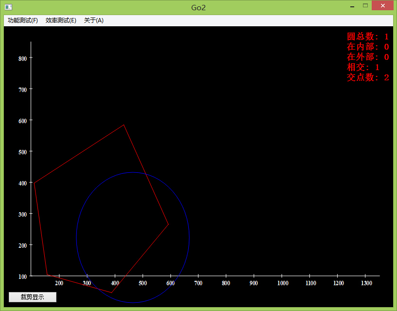

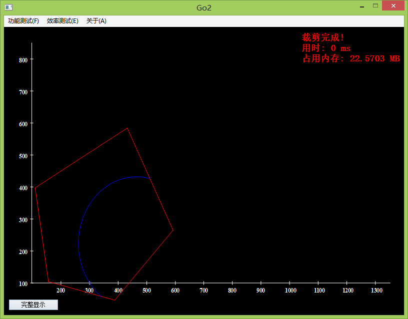

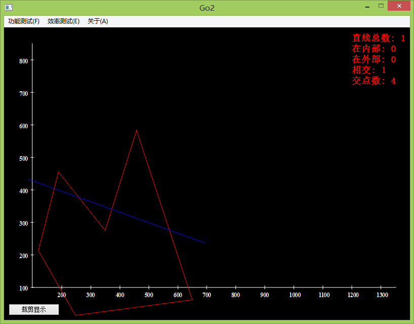

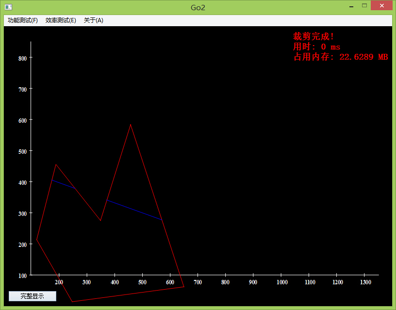

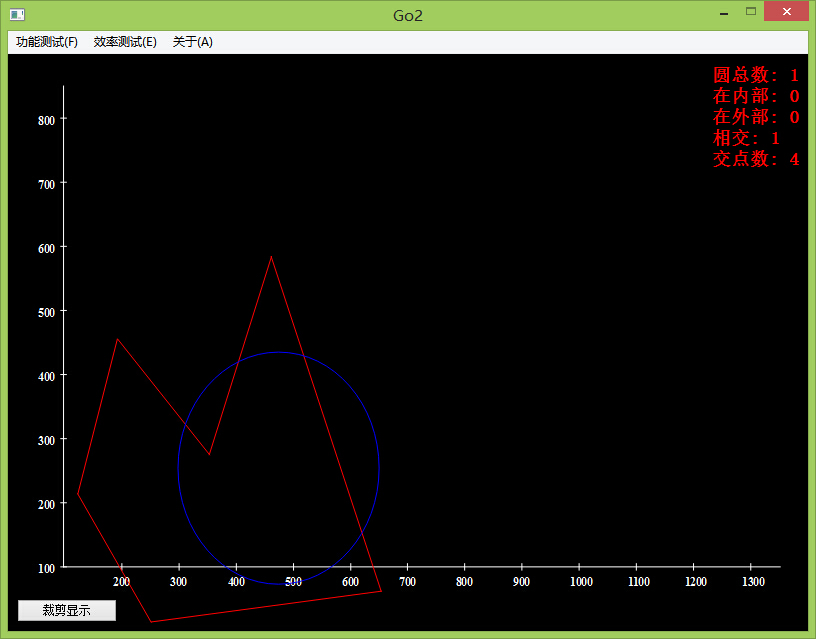

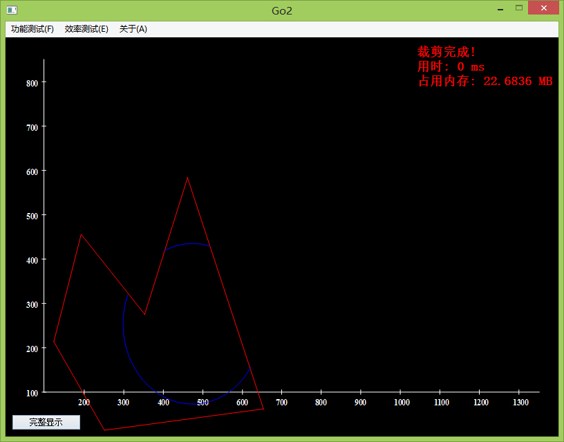

* Efficiency Test 效率测试

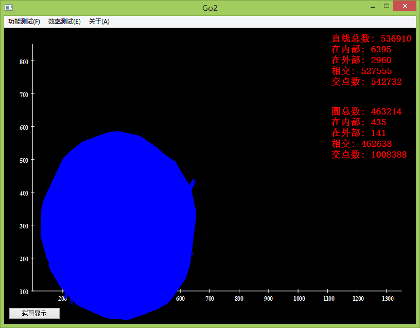

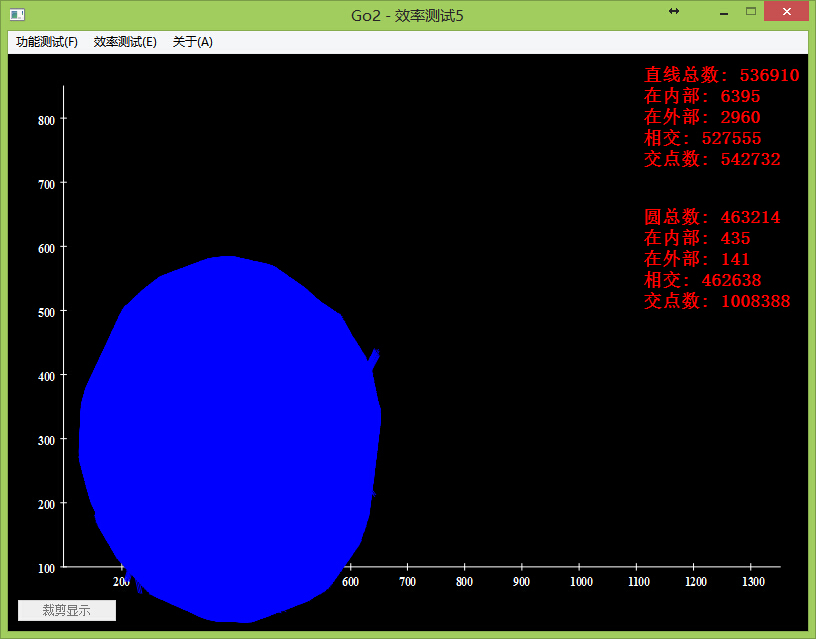

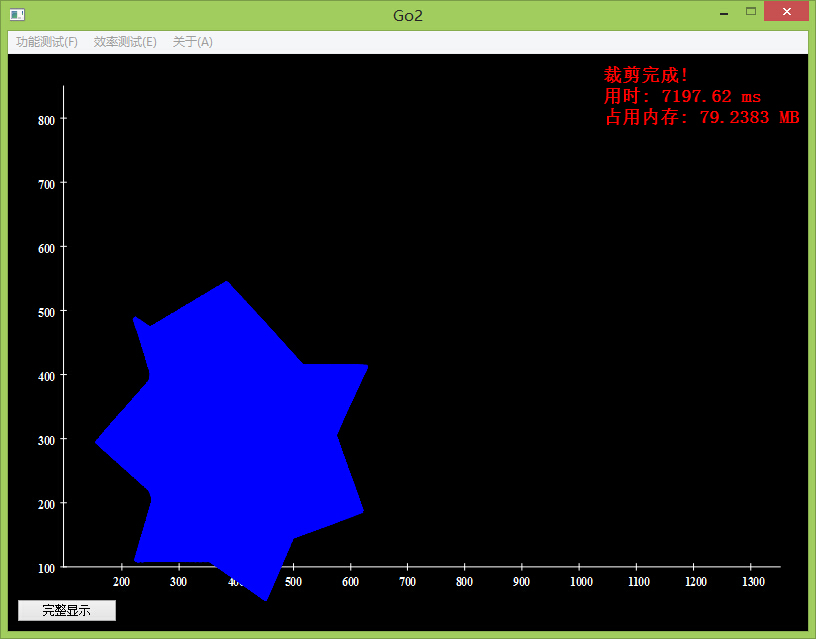

* Additional Test 附加测试

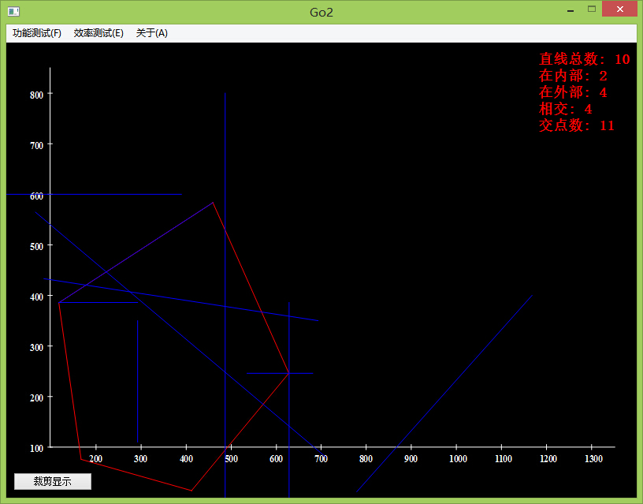

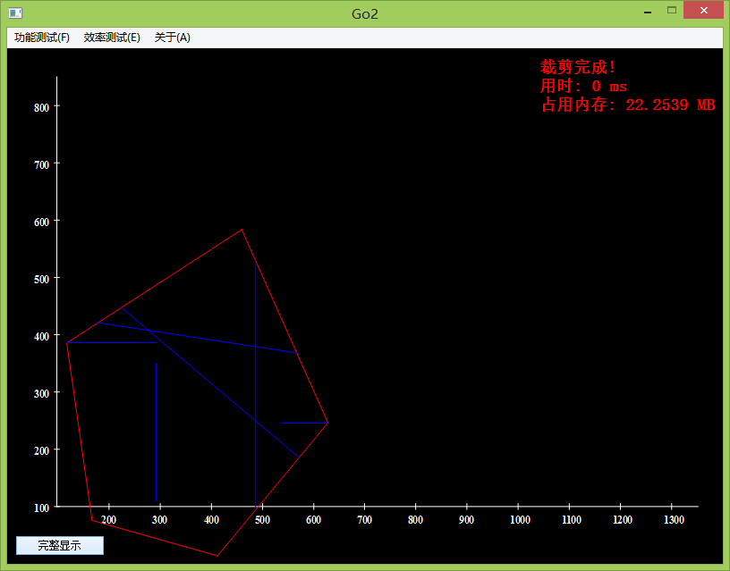

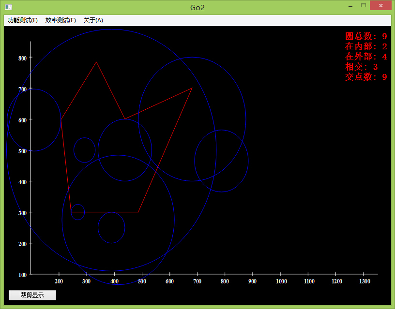

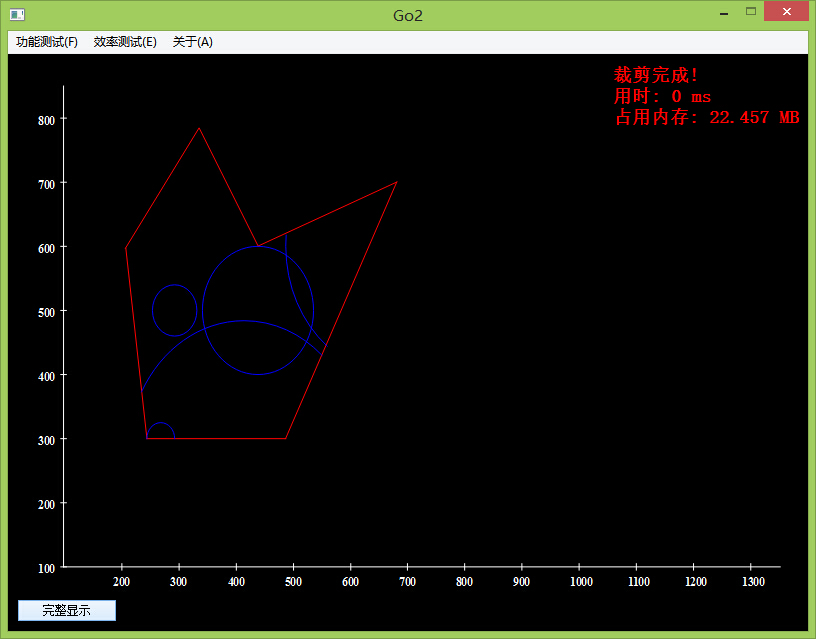

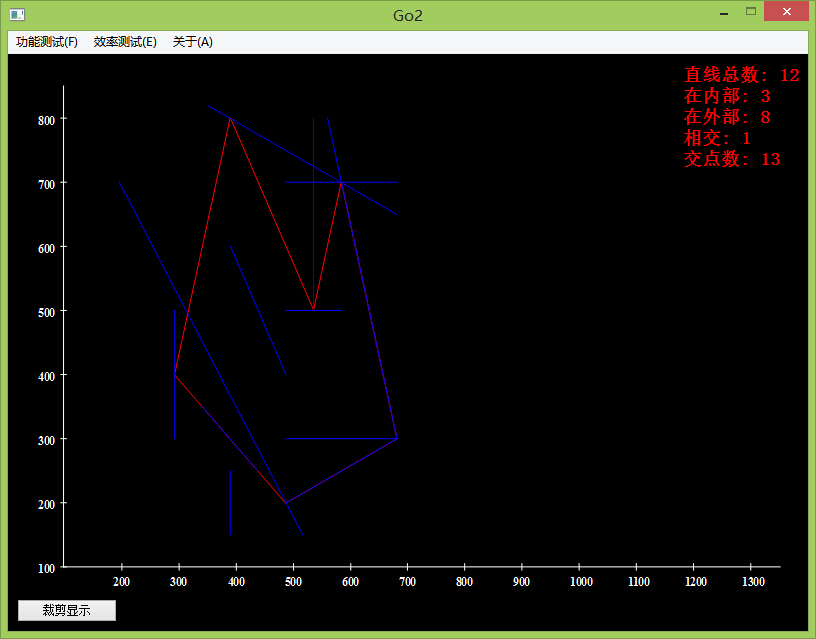

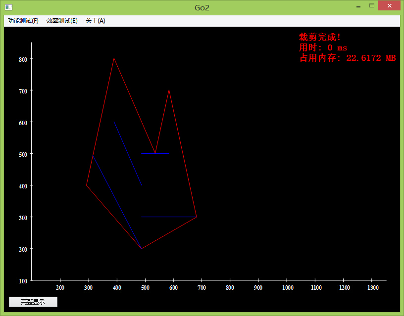

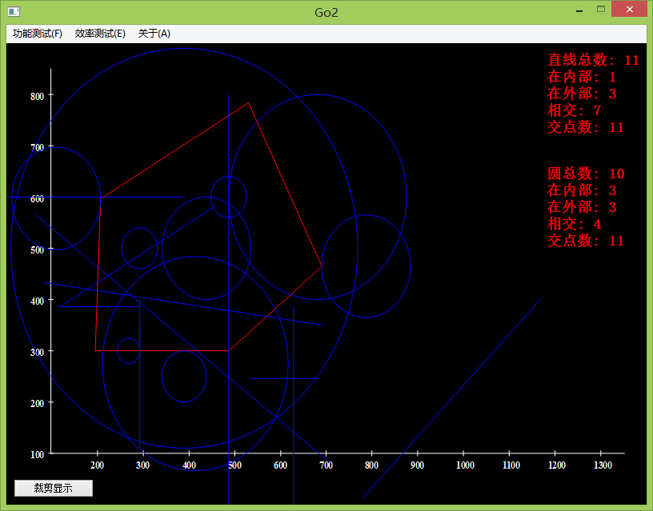

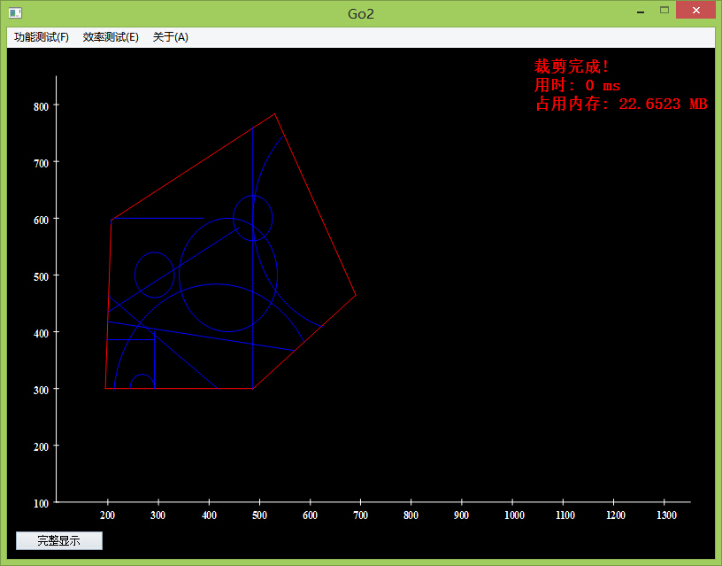

* Origin ReadMe

```
作品名:Go2 
赛题组类:A 类赛题 
赛题名称:矢量图形（line 和 circle）在非自交多边形边界中的裁剪显示 
作者:于留传 *** 
指导老师:江 涛 
Email:***** 
From:山东科技大学测绘学院遥感系

2015年4月14日14:46:13
```